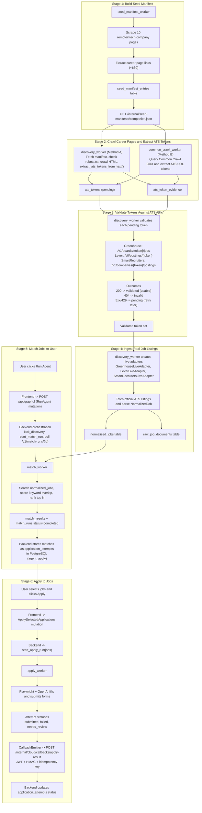

## Data Pipeline

```mermaid
flowchart TB
    subgraph s1["Stage 1: Build Seed Manifest"]
        s1w["seed_manifest_worker"]
        s1scrape["Scrape 10 remoteintech.company pages"]
        s1extract["Extract career page links (~630)"]
        s1table["seed_manifest_entries table"]
        s1manifest["GET /internal/seed-manifests/companies.json"]
        s1w --> s1scrape --> s1extract --> s1table --> s1manifest
    end

    subgraph s2["Stage 2: Crawl Career Pages and Extract ATS Tokens"]
        s2a["discovery_worker (Method A)<br/>Fetch manifest, check robots.txt, crawl HTML,<br/>extract_ats_tokens_from_text()"]
        s2b["common_crawl_worker (Method B)<br/>Query Common Crawl CDX and extract ATS URL tokens"]
        s2tokens["ats_tokens (pending)"]
        s2evidence["ats_token_evidence"]
        s2a --> s2tokens
        s2b --> s2tokens
        s2a --> s2evidence
        s2b --> s2evidence
    end

    subgraph s3["Stage 3: Validate Tokens Against ATS APIs"]
        s3validate["discovery_worker validates each pending token"]
        s3apis["Greenhouse: /v1/boards/{token}/jobs<br/>Lever: /v0/postings/{token}<br/>SmartRecruiters: /v1/companies/{token}/postings"]
        s3status["Outcomes<br/>200 -> validated (usable)<br/>404 -> invalid<br/>5xx/429 -> pending (retry later)"]
        s3validated["Validated token set"]
        s3validate --> s3apis --> s3status --> s3validated
    end

    subgraph s4["Stage 4: Ingest Real Job Listings"]
        s4ingest["discovery_worker creates live adapters<br/>GreenhouseLiveAdapter, LeverLiveAdapter, SmartRecruitersLiveAdapter"]
        s4fetch["Fetch official ATS listings and parse NormalizedJob"]
        s4jobs["normalized_jobs table"]
        s4raw["raw_job_documents table"]
        s4ingest --> s4fetch --> s4jobs
        s4fetch --> s4raw
    end

    subgraph s5["Stage 5: Match Jobs to User"]
        s5user["User clicks Run Agent"]
        s5graphql["Frontend -> POST /api/graphql (RunAgent mutation)"]
        s5backend["Backend orchestration<br/>kick_discovery, start_match_run, poll /v1/match-runs/{id}"]
        s5worker["match_worker"]
        s5score["Search normalized_jobs, score keyword overlap, rank top N"]
        s5results["match_results + match_runs.status=completed"]
        s5stored["Backend stores matches as application_attempts<br/>in PostgreSQL (agent_apply)"]
        s5user --> s5graphql --> s5backend --> s5worker --> s5score --> s5results --> s5stored
    end

    subgraph s6["Stage 6: Apply to Jobs"]
        s6user["User selects jobs and clicks Apply"]
        s6graphql["Frontend -> ApplySelectedApplications mutation"]
        s6backend["Backend -> start_apply_run(jobs)"]
        s6worker["apply_worker"]
        s6auto["Playwright + OpenAI fills and submits forms"]
        s6attempts["Attempt statuses<br/>submitted, failed, needs_review"]
        s6callback["CallbackEmitter -> POST /internal/cloud/callbacks/apply-result<br/>JWT + HMAC + idempotency key"]
        s6update["Backend updates application_attempts status"]
        s6user --> s6graphql --> s6backend --> s6worker --> s6auto --> s6attempts --> s6callback --> s6update
    end

    s1manifest --> s2a
    s1manifest --> s2b
    s2tokens --> s3validate
    s2evidence --> s3validate
    s3validated --> s4ingest
    s4jobs --> s5worker
    s5stored --> s6user
```
