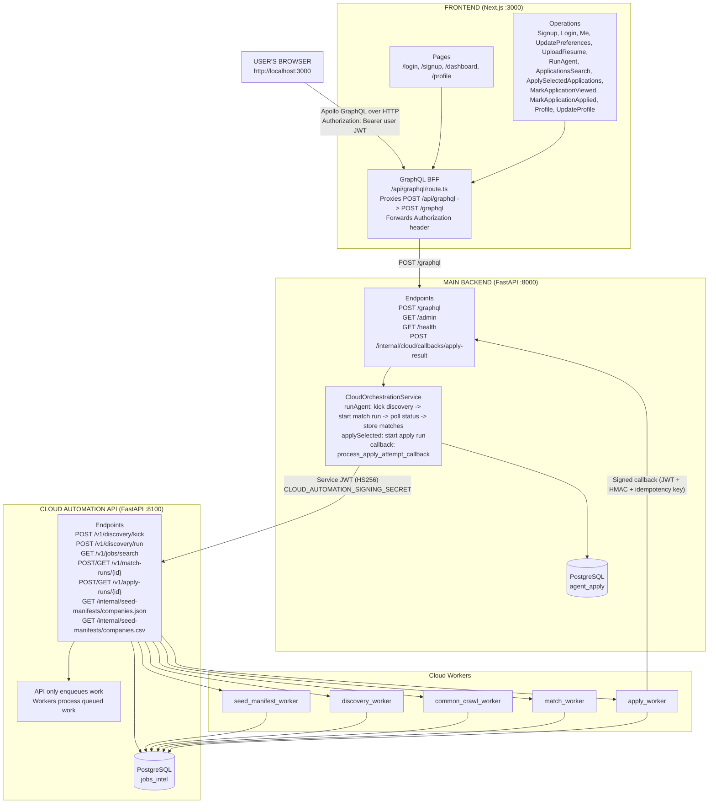

## System Architecture

```mermaid
flowchart TB
    browser["USER'S BROWSER<br/>http://localhost:3000"]

    subgraph frontend["FRONTEND (Next.js :3000)"]
        pages["Pages<br/>/login, /signup, /dashboard, /profile"]
        bff["GraphQL BFF<br/>/api/graphql/route.ts<br/>Proxies POST /api/graphql -> POST /graphql<br/>Forwards Authorization header"]
        ops["Operations<br/>Signup, Login, Me, UpdatePreferences, UploadResume,<br/>RunAgent, ApplicationsSearch, ApplySelectedApplications,<br/>MarkApplicationViewed, MarkApplicationApplied, Profile, UpdateProfile"]
    end

    subgraph main["MAIN BACKEND (FastAPI :8000)"]
        mapi["Endpoints<br/>POST /graphql<br/>GET /admin<br/>GET /health<br/>POST /internal/cloud/callbacks/apply-result"]
        msvc["CloudOrchestrationService<br/>runAgent: kick discovery -> start match run -> poll status -> store matches<br/>applySelected: start apply run<br/>callback: process_apply_attempt_callback"]
        mdb[("PostgreSQL<br/>agent_apply")]
    end

    subgraph cloud["CLOUD AUTOMATION API (FastAPI :8100)"]
        capi["Endpoints<br/>POST /v1/discovery/kick<br/>POST /v1/discovery/run<br/>GET /v1/jobs/search<br/>POST/GET /v1/match-runs/{id}<br/>POST/GET /v1/apply-runs/{id}<br/>GET /internal/seed-manifests/companies.json<br/>GET /internal/seed-manifests/companies.csv"]
        cnote["API only enqueues work<br/>Workers process queued work"]
        jdb[("PostgreSQL<br/>jobs_intel")]
    end

    subgraph workers["Cloud Workers"]
        seed["seed_manifest_worker"]
        disc["discovery_worker"]
        cc["common_crawl_worker"]
        match["match_worker"]
        apply["apply_worker"]
    end

    browser -->|"Apollo GraphQL over HTTP<br/>Authorization: Bearer user JWT"| bff
    pages --> bff
    ops --> bff
    bff -->|"POST /graphql"| mapi
    mapi --> msvc --> mdb

    msvc -->|"Service JWT (HS256)<br/>CLOUD_AUTOMATION_SIGNING_SECRET"| capi
    capi --> cnote
    capi --> jdb

    capi --> seed
    capi --> disc
    capi --> cc
    capi --> match
    capi --> apply

    seed --> jdb
    disc --> jdb
    cc --> jdb
    match --> jdb
    apply --> jdb

    apply -->|"Signed callback (JWT + HMAC + idempotency key)"| mapi
```
